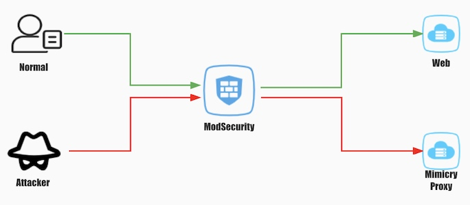

# Web Deception

## Demo

[](https://asciinema.org/a/mJzs9cFqA0BAZmnklZn1Hry16)

## Network Architecture




## Usage

### 1. Domain Binding

Bind the website demo.com to the IP of ModSecurity WAF

### 2. Deploy WAF rules

```
#Deploy forwarding rules on WAF to forward requests to the mimicry proxy. For testing purposes, we forward all requests to the mimicry proxy. honeypot_public_ip is the IP address of the previously deployed honeypot machine. The default port is 10080. So ${honeypot_public_ip_port} is honeypot_public_ip:10080 

SecRule REQUEST_HEADERS:Host "demo\.com$" "id:1,proxy:'[nocanon]http://${honeypot_public_ip_port}%{REQUEST_URI}'"

```

### 3. Test

```
# LFI
curl "http://demo.com/f?file=%2Fetc%2Fgroup&pp01000=1"

# SQL Injection
curl "http://demo.com/sqlib?p01001=6666666%27or%20sleep(10)=%27"

```

## Configuration

We can modify the honeypot/proxy-config.yaml configuration file to adjust the effect of vulnerability deception.

### Attribute

The functions corresponding to the attributes are as follows

* `listen.defaultremoteport` - the port of origin server(80/443)
* `listen.defaultscheme` - the scheme of origin server(http/https)
* `simulator.sqlinjection.enabled` - enable SQL Injection simulation
* `simulator.sqlinjection.frequency` - the frequency of SQL Injection(1/frequency)
