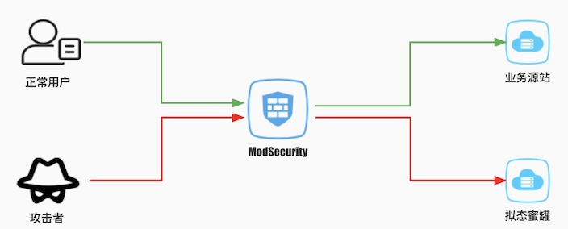

# Web Deception

## Demo

[](https://asciinema.org/a/mJzs9cFqA0BAZmnklZn1Hry16)

## 网络架构




## 使用说明

### 1. 绑定域名

将需要防护的网站demo.com的DNS地址指向ModSecurity WAF的IP

### 2. 部署WAF规则

```
#在WAF上部署转发规则，将请求转发到拟态蜜罐，测试需要，目前所有请求均转发至拟态蜜罐,honeypot_public_ip为之前部署的 蜜罐机器公网IP地址:10080

SecRule REQUEST_HEADERS:Host "demo\.com$" "id:1,proxy:'[nocanon]http://${honeypot_public_ip_port}%{REQUEST_URI}'"

```

### 3. 测试欺骗效果

```
# 测试文件包含漏洞
curl "http://demo.com/f?file=%2Fetc%2Fgroup&pp01000=1"

# SQL注入效果
curl "http://demo.com/sqlib?p01001=6666666%27or%20sleep(10)=%27"

```

## 高级配置

可以通过修改honeypot/proxy-config.yaml配置文件来调节漏洞欺骗的效果

### 属性列表

属性对应的功能如下

* `listen.defaultremoteport` - 对应源站监听的端口80/443
* `listen.defaultscheme` - 对应源站使用的协议http/https
* `simulator.sqlinjection.enabled` - 是否启用SQL注入模拟
* `simulator.sqlinjection.frequency` - SQL注入漏洞出现频率为(1/frequency)


